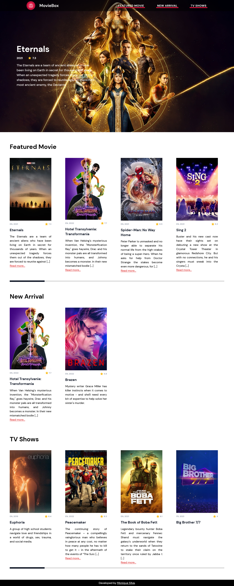

# MovieBox

MovieBox it's a project that simulates a movie themed website

---

### Preview



[Live Site](https://mss-moviebox.netlify.app/)

---

### Technology
- Semantic HTML5 markup
- CSS custom properties
- Flexbox
- Mobile-first workflow
- [Vue](https://vuejs.org/)
- [Tailwind](https://tailwindcss.com/)

---

### Run this project
```bash 
# You need to have a node on your machine to run the project
# Don't remember if you own the knot? Run node -v on your terminal
$ node -v

# Clone this repository
$ git clone https://github.com/moniquedsilva/moviebox.git

# Open the project folder
$ cd .\moviebox\

# Run yarn install to install dependencies
$ yarn install

# Run yarn run dev to start an app
$ yarn run dev

# The page will open on localhost on the port assigned in your terminal
```

---
Developed by [moniquedsilva](https://github.com/moniquedsilva)🌻
